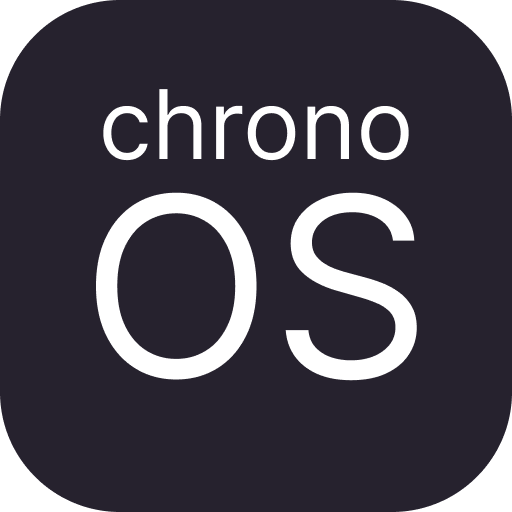
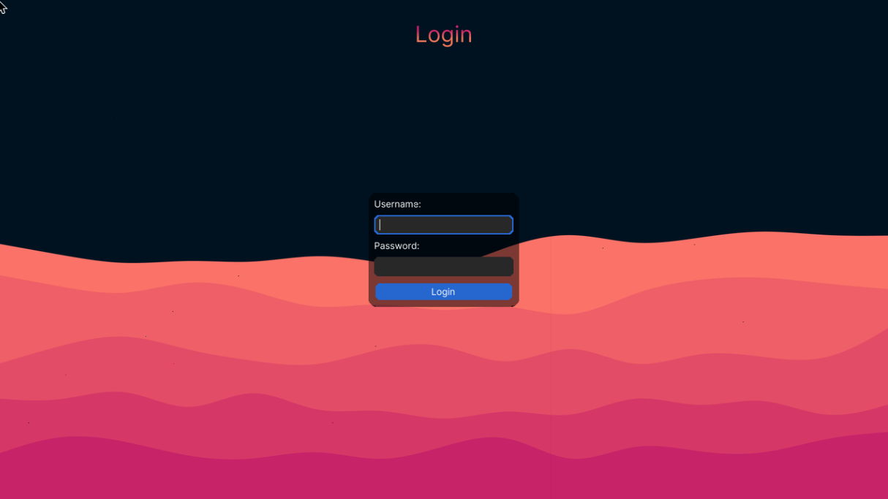
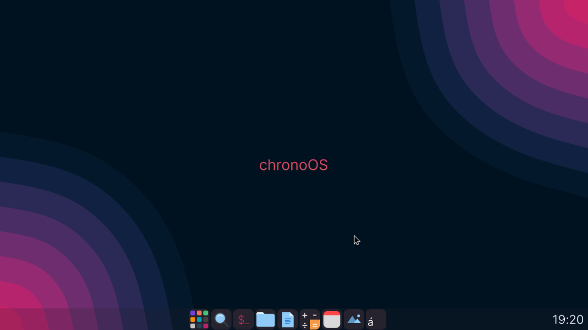
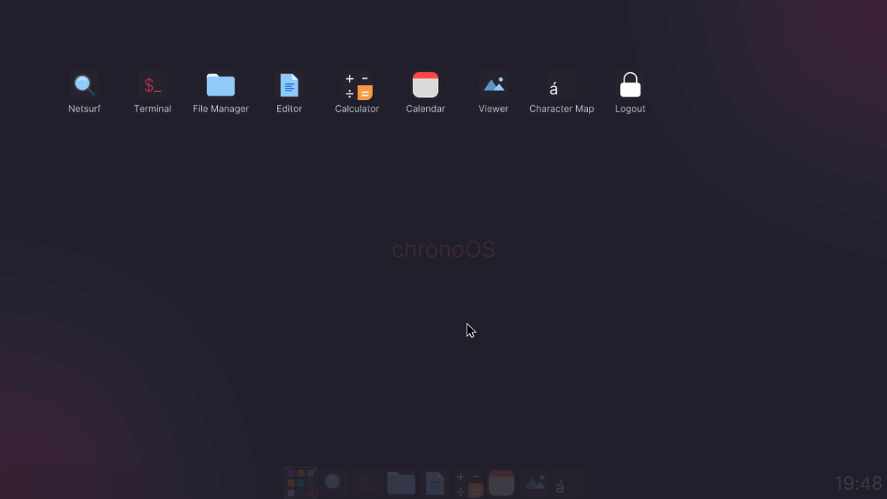
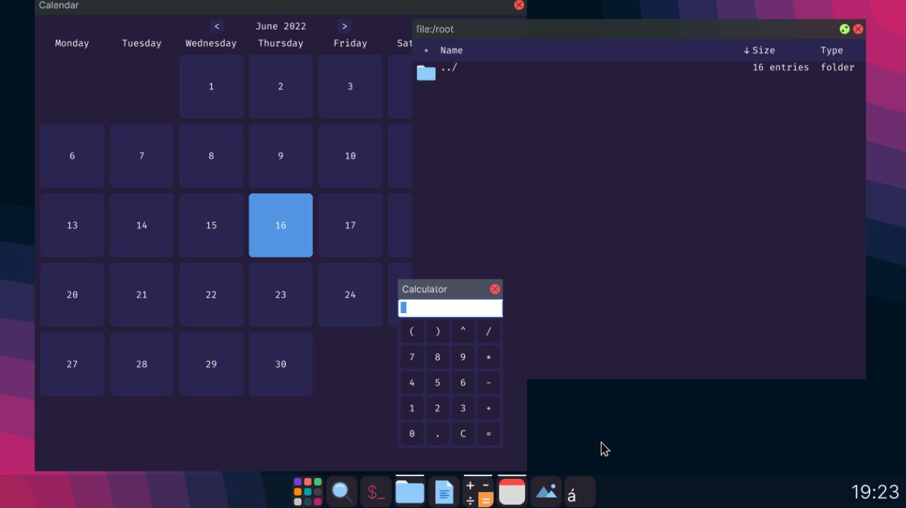

**chronoOS** is an operating system written in Rust, based on [RedoxOS](https://github.com/redox-os/redox)

It builds upon redox, upgrading the apperance and also soon add more useful apps and features.

